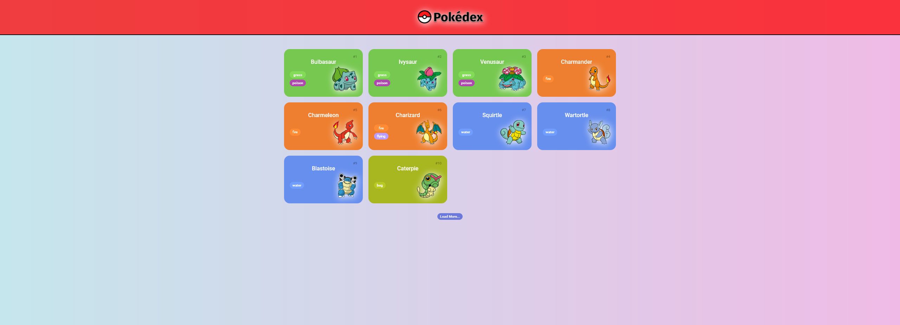

<h1 align="center">
   
  
   
</h1>

Plataforma de listagem de pokémons da primeira geração

 

O desafio de projeto tinha como finalidade criar um site com a listagem de todos os pokémons da primeira geração. Todos os dados sobre os pokémons como nome, número, tipo e imagem, foram possíveis com o uso da API REST [PokéApi](https://pokeapi.co/).

 

# Deploy

Você pode conferir o site clicando [aqui](https://murilopita.github.io/pokedex/).

 

<h1 align="center">
    Desktop Version
     
     
    
</h1>

<h1 align="center">
    Mobile Version
         
     
    
</h1>
